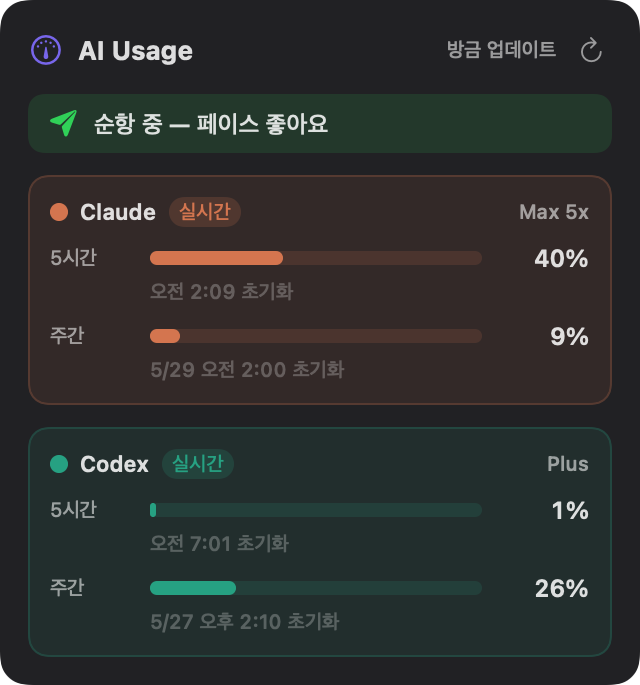
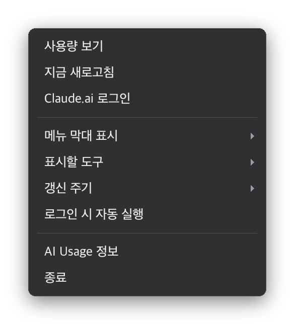

# AI Usage

Claude · Codex 사용량을 맥북 상단 메뉴 막대에 띄워주는 앱.

CLI에서는 토큰 사용량·한도를 한눈에 보기 어렵습니다. AI Usage는 메뉴 막대에
두 도구의 사용률을 작게 표시하고, 클릭하면 5시간·주간 한도를 자세히 보여줍니다.

<p align="center">
  
</p>

## 무엇을 보여주나

- **메뉴 막대** — `C`(Claude) / `X`(Codex) 사용률을 세로 두 줄로 표시.
  80% 이상 주황, 100% 이상 빨강.
- **팝오버**(좌클릭) — 도구별 카드에 **5시간**·**주간** 한도를 막대·%·리셋
  시각과 함께 표시.

## 실시간 한도 — 두 도구 모두

| 도구 | 방법 |
|------|------|
| **Codex** | `codex app-server` 의 `account/rateLimits/read` 를 호출해 계정의 실제 5시간·주간 한도를 가져옴 |
| **Claude** | 앱에 내장된 claude.ai 로그인 세션으로 claude.ai 사용량 API를 호출해 실제 한도를 가져옴 |

둘 다 **계정 단위 실제 수치**라, 어느 기기에서 사용하든 반영됩니다.

## 처음 설정

- **Codex** — 맥북에 Codex(앱 또는 CLI)가 설치·로그인되어 있으면 **자동**으로
  잡힙니다. 따로 할 것이 없습니다.
- **Claude** — 앱을 처음 켜면 claude.ai 로그인 창이 뜹니다. **한 번만** 로그인하면
  세션이 저장되어 이후로는 자동입니다. (Google 로그인이 막히면 "이메일로
  계속하기"를 쓰세요 — 우클릭 메뉴 → "Claude.ai 로그인" 으로 다시 열 수 있습니다.)

## 메뉴 막대 조작

- **좌클릭** — 상세 팝오버 열기
- **우클릭** — 아래 메뉴가 열립니다

<p align="center">
  
</p>

| 메뉴 | 설명 |
|------|------|
| 사용량 보기 | 상세 팝오버를 엽니다 |
| 지금 새로고침 | Claude·Codex 한도를 즉시 다시 불러옵니다 |
| Claude.ai 로그인 | claude.ai 로그인 창을 엽니다 (세션 만료 시 등) |
| 메뉴 막대 표시 ▸ | 메뉴 막대에 **5시간** / **주간** 중 무엇을 보일지 |
| 표시할 도구 ▸ | **Claude·Codex 모두** / **Claude만** / **Codex만** |
| 갱신 주기 ▸ | 자동 갱신 간격 — 10초 / 30초 / 1분 / 5분 / 10분 |
| 로그인 시 자동 실행 | 부팅 시 앱을 자동으로 시작 |
| AI Usage 정보 | 버전 정보 |
| 종료 | 앱 종료 |

## 빌드 & 실행

전체 Xcode 없이 Swift 툴체인(Command Line Tools)만으로 빌드됩니다.

```sh
cd "Usage App"
./build-app.sh --install          # 빌드 후 /Applications 에 설치
open "/Applications/AI Usage.app"
```

## 배포 (.dmg 만들기)

```sh
./make-dmg.sh                     # "AI Usage.dmg" 생성
```

GitHub Release 등에 올릴 디스크 이미지를 만듭니다. 받는 사람이 처음 열 때의
안내는 바로 아래 섹션을 참고하세요.

## 다운로드한 앱 처음 열기 (Gatekeeper 경고 해결)

내려받은 `AI Usage.dmg`로 앱을 처음 실행하면 macOS가 이런 경고를 띄웁니다:

> **"AI Usage.app" Not Opened**
> Apple could not verify "AI Usage.app" is free of malware that may harm your
> Mac or compromise your privacy.

### 방법 1 — 시스템 설정 (권장)

1. `AI Usage.dmg`를 더블클릭 → 열린 창에서 **AI Usage** 앱을 **Applications**
   폴더로 드래그합니다.
2. Applications 폴더에서 **AI Usage**를 더블클릭합니다. 위 경고창이 뜨면
   **Done(완료)** 을 눌러 닫습니다.
3. 화면 왼쪽 위 **Apple 메뉴() → 시스템 설정**을 엽니다.
4. 왼쪽 목록에서 **개인정보 보호 및 보안**을 선택합니다.
5. 오른쪽 화면을 아래로 스크롤하면 **보안** 항목에
   *"'AI Usage'이(가) … 차단되었습니다"* 문구와 함께 **"확인 없이 열기"**
   버튼이 보입니다 → 이 버튼을 누릅니다.
   *(이 버튼은 2번에서 한 번 실행을 시도한 직후에만 나타납니다.)*
6. 다시 뜨는 확인 창에서 **"확인 없이 열기"** → 암호 입력 또는 Touch ID.
7. 앱이 실행됩니다. **이후로는 그냥 더블클릭으로 열립니다.**

### 방법 2 — 터미널 (빠름)

1. `AI Usage.dmg` → **AI Usage** 앱을 **Applications** 폴더로 드래그합니다.
2. **터미널**(Terminal.app)을 열고 아래 한 줄을 붙여넣은 뒤 Enter 를 누릅니다:

   ```sh
   xattr -dr com.apple.quarantine "/Applications/AI Usage.app"
   ```

3. 이제 **AI Usage**를 평범하게 더블클릭하면 경고 없이 바로 열립니다.

## 갱신 주기

- 우클릭 메뉴 → **갱신 주기**에서 10초 / 30초 / 1분 / 5분 / 10분 중 선택 (기본 10초).
  새로고침 버튼을 누르거나 팝오버를 열면 즉시 갱신됩니다.

## 참고

- 한도 수치는 각 서비스의 API에서 가져오며, 인증은 Codex·claude.ai의 기존
  세션을 그대로 사용합니다. 대화 내용은 읽지 않습니다.
- claude.ai 세션은 이 앱 전용으로 저장되며 브라우저 쿠키는 건드리지 않습니다.
- claude.ai의 비공개 API를 사용하므로, Anthropic이 API를 바꾸면 갱신이 필요할
  수 있습니다.
